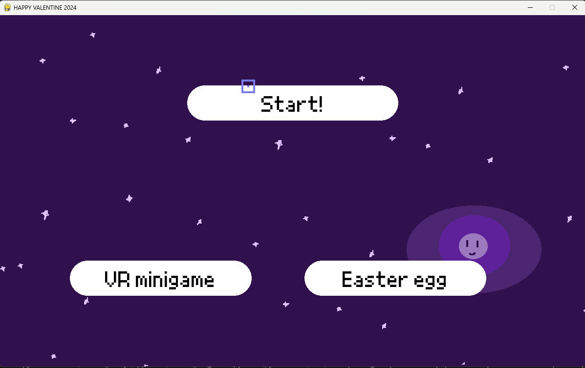
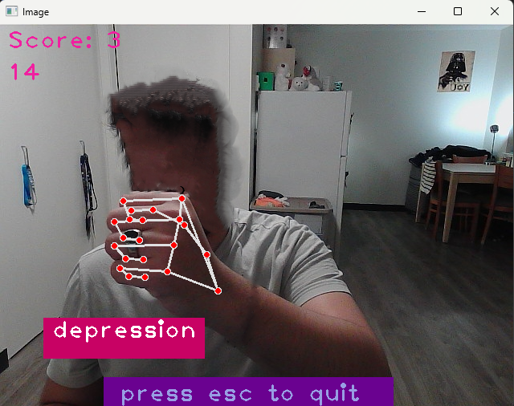
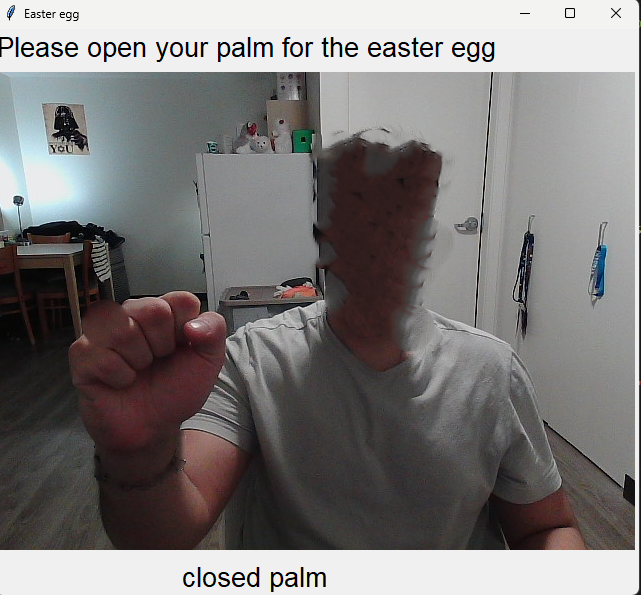

# Inspiration: 
This project serves as a gift to someone VERY CLOSE AND SPECIAL to me <3. and references a lot of inside jokes. It also serves as a challenge to combine all my data science and game development / software development skills to make a reliable and meaningful project.

# What is it?
This game has following features:

## Main game
The main game loop consists of a simple duck-hunt like shooting mechanics with re-emerging enemies that gets faster linearly (the current setting is quite lenient but could be changed depending on the player's expertise). 
  
The animations and sprites (quite basic) for this were created by hand using animating on 5th principle. It also required working with different sound effects at once and created a custom in-game cursor for shooting.

## AR game
mediapipe library was used to track the keypoints on the hand and then render the marking points as well the connecting line to show the hand skeleton on the video feed. These points were then used to check object collision with in built enemies so, you can HIT and DESTROY such enemies.

- face has been blurred for obvious reasons.

## Easter Egg
This required using a pre-trained model from another one of my project:  [ASL translator](https://github.com/PUSH-YA/NWHacks2024_final_app) to use transfer learning learning and retrain the model model to recognise open and closed palm gesture to show the "easter-egg". This easter egg is specific to the gift and thus, is not mentioned here. This model was trained from scratch, it used the keras library to train a convolutional neural network (with convolution and pooling layers) with adam loss and binary cross entropy optimiser to classify the open and closed hands. 

It used the old model from the previous project that was retrained and optimised on various hand images (including open and closed palms). Due to the limited time and computationality, the hyperparameters were optimised using manual search on validation set (inferring on how to optimise it further).

- face has been blurred for obvious reasons.

# Hardship:
- The hardship was to system design the game such that it transitioned between the computer vision aspect of the game and the main game loop shooting aspect of the game without causing any issues while still transferring the correct values. Ensuring that these different classes worked together while maintaining OOP principles such as cohesion and coupling seemed to be more and more challenging as the scope of the project grew (more features and more mini games).
- The other issue was making building the CNN model that recognises the hand however, the details of that is covered in another project: [ASL translator](https://github.com/PUSH-YA/NWHacks2024_final_app).

# Learned:
- how to work with the mediapipe library to work with pre-made computer vision model to work with a continuously locate key points of hands and render visual effects on them. 
- How to build several games in one project using PyGame, before this I had worked on different levels on the same game however, creating separate games with different 
- Using subprocess library to perform requirements check on the game 

# Future improvements
- Using py2app to make this game into a properly compiled game for Mac and Windows so anyone can play it directly.
- Further decrease the dependencies between the game and create more sustainable hierarchies. 
- The CNN model currently can be improved a lot more by retraining it specifically on a open and closed palm dataset and performing a more systematic hyperparameter optimisation and using dimensionality reduction such as PCA or t-SNE on the input data.
